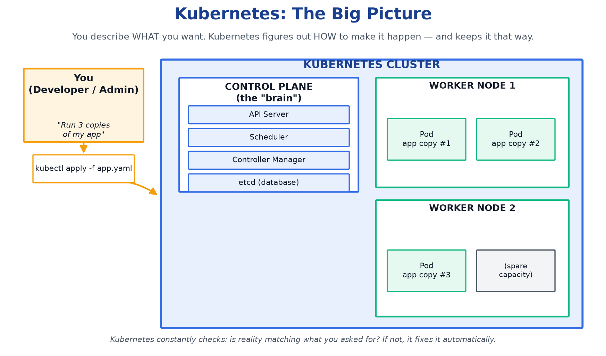
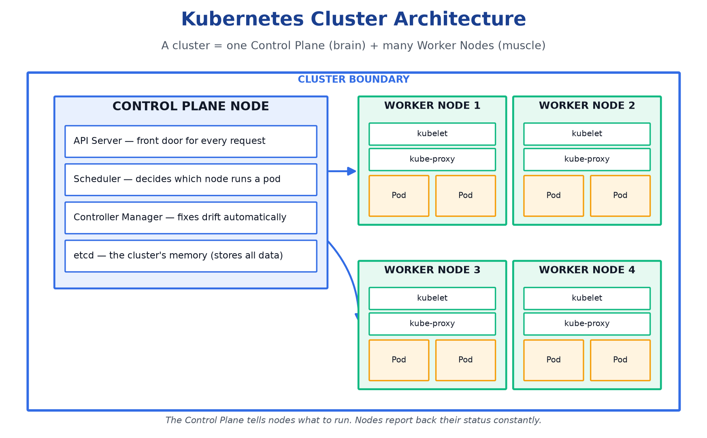
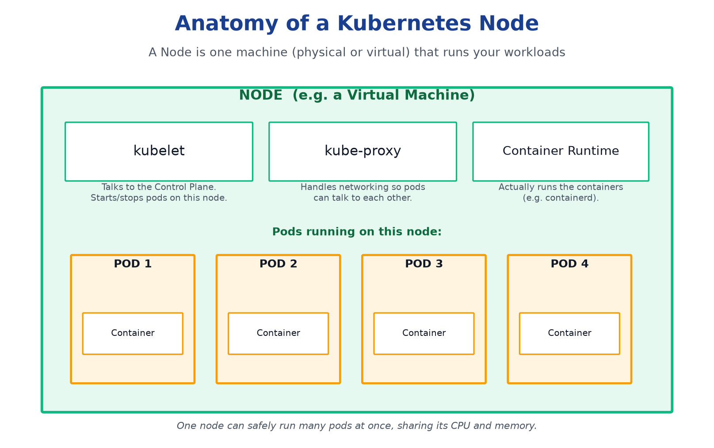
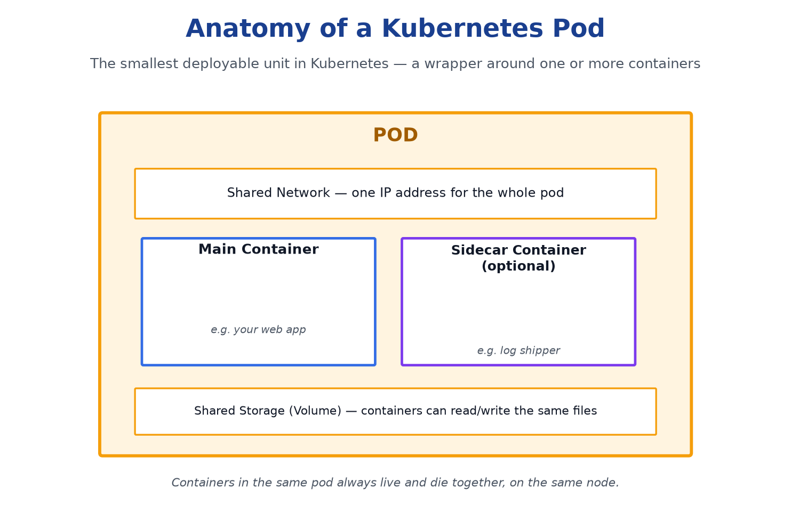
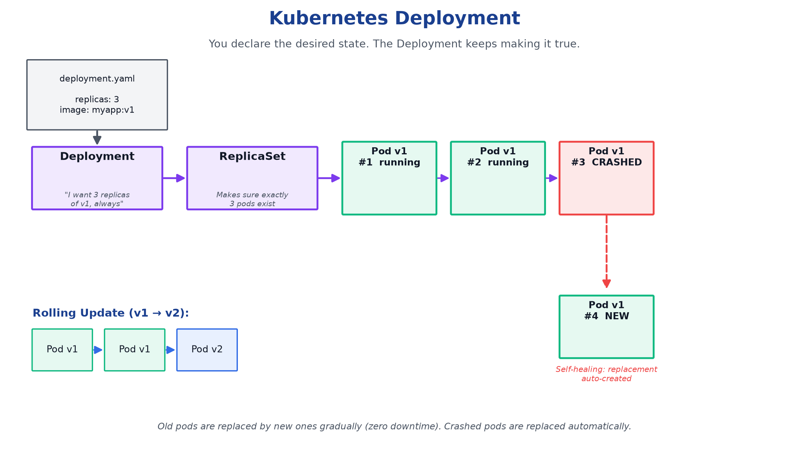

# Kubernetes Introduction 🎯

**A complete, zero-to-hero guide to Kubernetes — written in plain, simple English.**
No prior DevOps knowledge needed. If you can read this sentence, you can understand Kubernetes.

---

## 📖 Table of Contents

1. [What is Kubernetes?](#1-what-is-kubernetes)
2. [Why do we even need Kubernetes?](#2-why-do-we-even-need-kubernetes)
3. [Kubernetes Cluster](#3-kubernetes-cluster)
4. [Kubernetes Nodes](#4-kubernetes-nodes)
5. [Kubernetes Pods](#5-kubernetes-pods)
6. [Kubernetes Deployment](#6-kubernetes-deployment)
7. [How everything connects (A → Z recap)](#7-how-everything-connects-a--z-recap)
8. [Quick Glossary (A–Z)](#8-quick-glossary-az)
9. [Basic Commands to Try](#9-basic-commands-to-try)
10. [References](#10-references)

---

## 1. What is Kubernetes?

Imagine you built a small app (a website, a game server, anything). It works perfectly on your laptop.

Now imagine **1,000 people** want to use it at the same time. Your laptop can't handle that.
So you need to run **many copies** of your app on **many computers**, and someone needs to:

- Start the app copies
- Restart any copy that crashes
- Add more copies when traffic increases
- Remove copies when traffic drops
- Send users to a healthy copy (not a broken one)
- Update the app without turning it off

Doing all this **by hand** is a nightmare. **Kubernetes is the robot manager that does all of this automatically for you.**

> **Simple definition:** Kubernetes (nicknamed **"K8s"** — K, 8 letters, S) is a system that runs your applications on a group of computers, and keeps them running exactly the way you want, forever, without you manually checking on them.

It was originally built by Google (based on 15+ years of running billions of containers) and is now maintained by the open-source community.



**In one sentence:** You tell Kubernetes *"I want 3 copies of my app always running"* — and Kubernetes makes that true, and keeps it true, forever.

---

## 2. Why do we even need Kubernetes?

Before Kubernetes, apps were often packaged as **containers** (using tools like Docker) — a container is like a sealed lunchbox that has your app + everything it needs to run, so it behaves the same everywhere.

But once you have **hundreds of containers** across **many servers**, you need a manager. That manager is Kubernetes. It handles:

| Problem | How Kubernetes solves it |
|---|---|
| App crashes | Automatically restarts it |
| Too much traffic | Automatically adds more copies (scaling) |
| A server dies | Moves your app to a healthy server |
| Releasing a new version | Updates gradually with **zero downtime** |
| Users need to reach the app | Built-in networking & load balancing |

---

## 3. Kubernetes Cluster

A **Cluster** is the entire "team" of computers that Kubernetes controls. Think of it like an **apartment building**:

- The **Control Plane** is the **building manager's office** — it makes all the decisions (who lives where, what needs fixing).
- The **Worker Nodes** are the **apartments/floors** — this is where the actual tenants (your apps) live and work.

A cluster = **1 Control Plane** + **1 or more Worker Nodes**.



### The Control Plane has 4 main parts:

| Component | Simple Job |
|---|---|
| **API Server** | The front door. Every command (from you, or any tool) goes through here first. |
| **Scheduler** | Decides *which* Worker Node is free enough to run a new app copy. |
| **Controller Manager** | Constantly checks: "Is everything the way it should be?" Fixes it if not. |
| **etcd** | The cluster's memory/notebook — stores all cluster information safely. |

You almost never talk to these directly — you just use a tool called `kubectl` (Kubernetes Control), and it talks to the API Server for you.

---

## 4. Kubernetes Nodes

A **Node** is simply **one machine** (a physical server or a virtual machine) that is part of the cluster and does the actual work of running your applications.

There are two kinds:
- **Control Plane Node** — runs the "brain" (see Section 3)
- **Worker Node** — runs your actual application containers



### Every Worker Node runs 3 key helpers:

| Component | Simple Job |
|---|---|
| **kubelet** | The node's local assistant. Takes orders from the Control Plane and starts/stops apps here. |
| **kube-proxy** | The node's receptionist. Routes network traffic so apps can find and talk to each other. |
| **Container Runtime** | The actual engine that runs the containers (e.g., containerd, similar to Docker). |

💡 **Analogy:** If the Cluster is a company, a Node is one office branch, and it can host many employees (Pods) at once.

---

## 5. Kubernetes Pods

A **Pod** is the **smallest unit** Kubernetes works with. You never run a "container" directly in Kubernetes — you always run it inside a **Pod**.

Most of the time, a Pod = 1 container (your app). But sometimes a Pod holds 2 or more tightly-linked containers that must always live together (like a main course and its side dish — they're always served on the same plate).



### What makes a Pod special:

- All containers **inside one Pod share the same network address (IP)** — they can talk to each other like roommates in the same apartment.
- They can **share storage** — like a shared fridge.
- If the Pod dies, **all containers inside it die together** and get recreated together.

💡 **Analogy:** A Pod is like a food delivery box — it might contain just your burger, or a burger + fries + drink — but it's delivered and tracked as **one single package**.

> ⚠️ Pods are **disposable**. Kubernetes doesn't try to "fix" a broken Pod — it just throws it away and creates a fresh new one. That's why we rarely create Pods directly — we use a **Deployment** to manage them (next section).

---

## 6. Kubernetes Deployment

If Pods are disposable, who makes sure there are always enough of them running? That's the **Deployment**'s job.

A **Deployment** is a set of instructions that says:
> "I want **3 copies** of my app, using **image version v1**, running at all times."

Kubernetes then creates a helper called a **ReplicaSet**, whose only job is to **count and maintain** the exact number of Pods you asked for.



### What a Deployment gives you for free:

| Feature | What it means in simple English |
|---|---|
| **Self-healing** | If a Pod crashes, a new one is created automatically — no human needed. |
| **Scaling** | Need more capacity? Change `replicas: 3` to `replicas: 10`. Done. |
| **Rolling Updates** | Update your app version gradually (one Pod at a time) so users never see downtime. |
| **Rollback** | Something broke after an update? Instantly go back to the previous working version. |

### A real (tiny) example of a Deployment file:

```yaml
apiVersion: apps/v1
kind: Deployment
metadata:
  name: my-first-app
spec:
  replicas: 3                 # I want 3 copies, always
  selector:
    matchLabels:
      app: my-first-app
  template:
    metadata:
      labels:
        app: my-first-app
    spec:
      containers:
      - name: my-app-container
        image: nginx:latest    # the app to run
        ports:
        - containerPort: 80
```

You save this as `deployment.yaml` and run:

```bash
kubectl apply -f deployment.yaml
```

That's it — Kubernetes takes it from here.

---

## 7. How everything connects (A → Z recap)

```
YOU  →  write a YAML file  ("I want 3 copies of my app")
  ↓
kubectl  →  sends your request to the API Server
  ↓
CLUSTER  →  the whole system that will fulfill your request
  ↓
CONTROL PLANE  →  the brain: decides WHERE things should run
  ↓
NODE(S)  →  the actual machines that DO the running
  ↓
POD(S)  →  the small package that wraps your container
  ↓
CONTAINER  →  your actual application code, finally running
  ↓
DEPLOYMENT  →  watches over all of the above, forever,
               fixing crashes and handling updates automatically
```

---

## 8. Quick Glossary (A–Z)

| Term | Plain English Meaning |
|---|---|
| **API Server** | The front door of the cluster; all requests pass through it. |
| **Cluster** | The whole group of machines managed by Kubernetes. |
| **Container** | A packaged app that runs the same everywhere. |
| **Container Runtime** | The engine that actually runs containers on a node. |
| **Control Plane** | The "brain" that makes all cluster decisions. |
| **Deployment** | Instructions that keep a set number of app copies running. |
| **etcd** | The cluster's database/memory. |
| **kubectl** | The command-line tool you use to talk to Kubernetes. |
| **kubelet** | The agent on each node that starts/stops pods. |
| **kube-proxy** | Handles networking on each node. |
| **Namespace** | A way to divide one cluster into separate virtual "rooms." |
| **Node** | One machine (physical or virtual) in the cluster. |
| **Pod** | The smallest deployable unit — wraps one or more containers. |
| **ReplicaSet** | Ensures the exact number of Pods you asked for exist. |
| **Rolling Update** | Updating an app gradually with zero downtime. |
| **Scheduler** | Decides which node a new Pod should run on. |
| **Self-healing** | Automatically replacing crashed/broken Pods. |
| **Service** | A stable network address that always points to healthy Pods. |
| **Worker Node** | A machine that runs your actual application Pods. |
| **YAML** | The plain-text format used to describe what you want Kubernetes to do. |

---

## 9. Basic Commands to Try

```bash
kubectl version                    # check kubectl & cluster version
kubectl get nodes                  # list all nodes in the cluster
kubectl get pods                   # list all running pods
kubectl get deployments            # list all deployments
kubectl apply -f deployment.yaml   # create/update from a YAML file
kubectl describe pod <pod-name>    # see full details of a pod
kubectl logs <pod-name>            # view a pod's logs
kubectl scale deployment my-first-app --replicas=5   # scale up/down
kubectl delete -f deployment.yaml  # remove what you created
```

---

## 10. References

All content here is a simplified explanation built on top of the **official Kubernetes documentation**:

- 📘 Official Kubernetes Docs: **https://kubernetes.io/docs/home/**
- 📘 Kubernetes Concepts: https://kubernetes.io/docs/concepts/
- 📘 kubectl Reference: https://kubernetes.io/docs/reference/kubectl/

> This README is an educational, beginner-friendly summary. For production use, always refer to the official documentation above.

---

⭐ If this helped you understand Kubernetes, feel free to star this repo!
